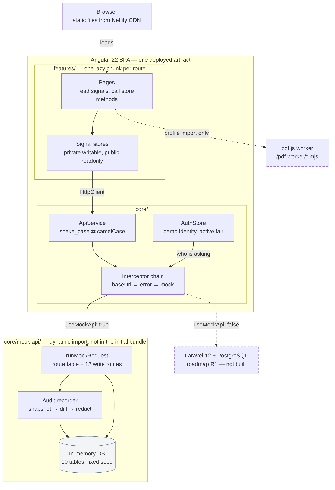

# BankFair

A career fair operations portal for organiser staff, employers and job seekers, built with **Angular 22** and **Tailwind CSS v4**.

> Portfolio demo. The frontend runs against an in-memory mock HTTP API; a Laravel 12 + PostgreSQL backend replaces it later without touching a line of feature code.

**Live demo:** https://majestic-rabanadas-a04cc0.netlify.app

Use the menu in the top right to switch between the four demo identities — no sign-in.

| Identity | Role | Sees |
|---|---|---|
| Farah Iskandar | Staff | Dashboard, fairs, floor plan, employer pipeline, registrations queue, activity log |
| Daniel Lim | Employer | Talent pool, shortlist, interviews, fair applications (has a shortlist and bookings) |
| Priya Nair | Employer | The same screens, with nothing shortlisted yet |
| Ahmad Zaki Abdullah Sani | Job seeker | Career fairs to register for, and his own profile |

---

## Features

### Staff

- **Dashboard** — four KPIs, booths assigned per fair, pipeline value by stage. Charts load only when scrolled into view.
- **Fairs** — list with status and city filters that live in the URL, plus a detail page whose Overview, Floor plan and Employers tabs are each their own route, so any tab can be linked or refreshed.
- **Floor plan** — a 40-booth grid per fair. Drag an unassigned employer onto a booth, or select a booth and use *Assign employer*. Dropping onto an occupied booth asks before replacing; a successful assignment offers Undo.
- **Employer pipeline** — a Kanban board from Lead to Paid, with each column's committed value in its header. Drag a card or use its menu. Moving to Lost requires a reason; moving to Paid requires a booth package, and opens the edit form if one is missing.
- **Registrations** — the queue of employers applying to attend a fair. Approve, or turn down with a reason the employer then sees. Approving puts them on the fair and confirms them on the pipeline, which is what makes them assignable to a booth.
- **Settings → Activity** — every change made in this session, whoever made it, with the fields that changed. Personal fields record *that* they changed and nothing more.

### Employer

- **Talent pool** — 300 candidates, server-side sorted and paginated, with five filters and a debounced search. Shortlist straight from a row rather than opening each profile. Every filter is in the URL, so a filtered view can be shared or refreshed.
- **Candidate profile** — a deep-linkable drawer. Contact details are masked until the candidate is shortlisted.
- **Shortlist** — per fair, with full contact details and notes.
- **Interviews** — twenty-minute slots from 10:00 to 17:00, per day of the fair. Book a shortlisted candidate; a slot taken in the meantime returns a conflict and refreshes the grid.
- **Fairs** — apply to attend an open fair, see where the application stands, and read the reason if it was turned down. A rejection can be reapplied to; a pending one cannot.

### Job seeker

- **Career fairs** — browse open fairs and register, with an explicit consent step that says what registering actually does: it makes the profile visible to employers at that fair. Withdrawing asks first.
- **My profile** — the same record employers browse, editable by the person it belongs to and nobody else.
- **Import from LinkedIn** — LinkedIn's own *Save to PDF* export, parsed in the browser. The file is never uploaded. What it found is shown first, fields it could not read are named rather than left quietly blank, and nothing is stored until Save.

### Throughout

- Every data view has four states: loading (skeletons shaped like the content), empty, error with Retry, and loaded.
- Every drag action has a keyboard equivalent, and outcomes are announced with `LiveAnnouncer`.
- Nothing is silent. Navigation shows a progress bar while its lazy chunk loads, and every action button carries a spinner while its request is in flight — the label stays put, so the button does not move under the pointer.
- **Settings**, at the bottom of the nav for every role, holds the demo controls. **Simulate errors** fails roughly one request in five, so the error paths can be demonstrated rather than described; **Reset demo data** reseeds everything, and asks first.

---

## Architecture



One-way data flow: **API service → store (signals) → components**. Components read signals and call store methods; they never subscribe and never call `HttpClient`.

Three more diagrams live in [`docs/diagrams/`](docs/diagrams/) — one write traced end to end, the data model, and the two lifecycles. Each carries its own notes on what it leaves out.

### Why the mock is an interceptor

Features call `HttpClient` exactly as they will against Laravel, so nothing in `features/` knows the data is fake. Swapping backends is one flag in `environment.ts` — `core/mock-api/` simply stops being reached. It also means failures arrive as real `HttpErrorResponse` values, so the error paths are genuinely exercised rather than simulated.

### Folder structure

```
src/app/
├── core/        auth, http, models, layout, mock-api, audit recorder, error handler
├── shared/      reusable UI, pipes, utils
└── features/    dashboard, fairs, employers, talent-pool, shortlist, interviews,
                 applications, job-seeker, settings
```

See `docs/04-architecture.md` for the full contract, including every endpoint.

---

## Tech decisions

| Decision | Why |
|---|---|
| **Signal stores, not NgRx** | One store per feature, no extra dependency, and the whole pattern fits on a screen. NgRx SignalStore is the next step if this grew. |
| **Mock API as an interceptor** | Keeps feature code backend-agnostic; the Laravel swap is a flag, not a refactor. |
| **snake_case ⇄ camelCase in one place** | `ApiService` converts both directions, including query parameter names, so models stay idiomatic TypeScript and the wire stays Laravel-shaped. |
| **Server-side sort and pagination** | Indistinguishable from client-side at 300 records, but the semantics match what Laravel will do, so switching backends changes no behaviour. |
| **Optimistic where safe, not where it lies** | Drag operations apply immediately and roll back on failure. Booking an interview does not: a conflict there means someone else took the slot, which an optimistic update would paper over. Shortlisting does not either, because the server's response is what unmasks the contact details. |
| **Masking enforced server-side** | The API withholds candidate emails and phones until shortlisted, so an unmasked value never reaches the browser. The `maskEmail` pipe is presentation only and says so. |
| **`DATE_PIPE_DEFAULT_OPTIONS`** | `LOCALE_ID` sets formats but not the timezone. Without pinning `+0800`, a 10:00 slot renders as 02:00 for anyone outside Malaysia. |
| **One hue per chart** | The `docs/03` status palette was measured and fails the colourblind-safety checks (teal↔green ΔE 8.6, red↔green 4.2 under deuteranopia). Charts carry identity in axis labels instead. |
| **Audit log written by the engine, never by a handler** | Recording sits at the one point every write passes through, with a per-route descriptor. A handler that forgets to log is an invisible hole; a route missing its descriptor is a failing test. Nothing in the app can add an entry or edit one, which is the only property that makes a log worth reading. |
| **Personal fields are recorded as changed, not as values** | An audit log is a second store of whatever it copies. Copying someone's old and new phone number into it duplicates exactly the data the masking rules exist to contain, and would leave that copy needing its own retention rule. Enforced at the recording layer, so no view can reveal what was never written. |
| **Profile import parses the PDF in the browser** | LinkedIn's API returns name and email and nothing else — positions and education need a partnership that a project like this cannot get. Its own *Save to PDF* export carries all of it, and parsing locally means the CV never leaves the device, which is both the strongest privacy position available and a true one. |
| **A parse never saves** | Résumé parsing is heuristic and will be wrong. What it found is shown first, fields it is unsure about stay empty rather than guessed, and the person confirms before anything is stored. |
| **Loading indicators in CSS, not Material** | Measured, not assumed: `mat-progress-bar` + `mat-progress-spinner` cost 21.55 kB and push the initial bundle past its 650 kB budget. The CSS pair costs 1.77 kB. |
| **Tailwind for layout, Material for components** | Tailwind v4 emits into `@layer`; Material's styles are unlayered, and unlayered beats every layer. So a utility on a Material internal silently does nothing. Tailwind owns layout and rhythm; Material is themed through its own tokens. Tailwind's default palette and type scale are removed, so `bg-blue-500` does not exist and the token system cannot be bypassed. |

---

## Accessibility

Targeting WCAG 2.2 AA.

- Every colour pair in `_tokens.scss` is measured, not assumed. Text pairs clear 4.5:1; UI boundaries clear 3:1. `--fo-border-strong` was darkened to `#64748B` after measuring the original at 1.48:1 — it is the only indicator of an empty booth or an open slot.
- Status is never colour alone: chips and slots carry a label and an icon, and KPI deltas carry a direction arrow.
- Every drag action has a keyboard path, and both paths run through the same code, so they enforce the same rules.
- Dialogs trap and restore focus (Material), Escape closes them, and a dirty form asks before discarding.
- A skip link is the first tab stop. Canvas charts carry an `aria-label` and a visually hidden data table.
- `prefers-reduced-motion` collapses the motion tokens to zero and disables the skeleton shimmer.
- Touch targets reach 44px under `pointer: coarse`; the denser 36px default applies on mouse, which satisfies 2.5.8.
- Every ramp step below 500 is barred from carrying text or acting as a boundary, because step 400 measures 2.64:1 and 2.96:1 — under the 3:1 a UI boundary needs. That rule exists because `--fo-border-strong` once shipped at 1.48:1.
- axe runs over all eighteen pages in all three roles at three viewports — 1440, 1024 and 390 — behind the real production CSP, plus the dialogs and the transient busy states. 54 page-checks, zero violations.
- A busy button fades its label rather than swapping it, so the box keeps its width and does not move under the pointer, and the text stays in the accessibility tree — the button is still named "Save profile" while `aria-busy` is set. Measured at 0.0 px shift.
- Reduced motion slows the spinner rather than stopping it; a still ring reads as a broken icon.

---

## Getting started

Requires **Node.js ≥ 22.22.3** — the Angular 22 CLI hard-fails below it. npm ≥ 11 for `npm install`; `npm ci` works on any version.

```bash
npm ci
npm start                      # dev server on :4200
npm run build                  # production build → dist/bank-fair/browser
npm test -- --watch=false      # 350 unit tests (Vitest), single run
npm run lint                   # angular-eslint
```

---

## How this was built

Written end to end with **Claude Code on the web** — cloud sessions at claude.ai/code, no local machine involved. The approach was documentation-first: `CLAUDE.md` and seven files in `docs/` specified the stack, engineering rules, UX flows, design system, architecture, seed data and a phased build plan *before* any code existed. Each phase was one session, reviewed through a Netlify deploy preview.

The interesting part was where the documentation turned out to be wrong, and the code had to disagree with it:

- **The seed targets were arithmetically impossible.** `docs/05` asked for 122 occupied booths across the fairs, but its own employer distribution caps the total at 120 — and at 30 for any single fair against a target of 38. Booths became the source of truth and each fair's count is derived from them, so the floor plan, fair list and dashboard cannot disagree.
- **The design system's status palette failed a colourblind check.** Running it through a validator before writing chart code showed teal and green only ΔE 8.6 apart for normal vision. The chips keep the palette; the charts do not.
- **`--fo-border-strong` claimed ≥3:1 and measured 1.48:1.** Caught by computing every token pair rather than trusting the table.
- **Every timestamp was rendering in the viewer's timezone.** A test running in UTC showed interview slots at "2:00 am". `LOCALE_ID` does not set the zone.
- **Drag-assign on the floor plan had never worked.** The list of unassigned employers was a plain list of draggables with no drop list, and a drag belonging to no drop list can be picked up but never dropped into one — so the handler never fired. The keyboard path did work, which is why four phases of review and two accessibility audits missed it. Found by driving the drag in a real browser rather than reading the template.
- **Every HTTP status was collapsing to 0.** The error interceptor normalises failures and rethrows, so stores received an already-normalised error that the normaliser did not recognise as its own output. No 409 read as a conflict and no 422 reached a form field. Every test passed, because `HttpTestingController` bypasses interceptors — the gap was the test strategy, not the assertions.
- **The PDF parser welded two columns together.** Its first real import produced the skill `SQL Summary` — a sidebar entry fused to the main column's next heading, because LinkedIn's layout is two columns and a shared baseline is not one line. Lines are now split on horizontal gaps as well as grouped by baseline.
- **The parser took a contact line as a headline.** On a plain CV it read `name@example.com | 012-3456789` as the headline — which would publish, in the field employers read first, the very details the masking rules protect.
- **The CSP worry was the wrong worry.** pdf.js 6 has no `eval` or `new Function` left, so `script-src 'self'` was never the problem. What actually broke the worker was a missing JavaScript MIME type, which fails as a silent error event that reads like broken code rather than a wrong header.
- **The audit log's reset entry is written and then destroyed.** The handler test proved the entry lands in the rebuilt database; the browser showed the page reloads straight afterwards and the whole in-memory database goes with it. The empty state now explains itself instead of looking like a log that lost its contents.
- **A filter derived from what is on screen destroys itself.** Choosing one entity in the activity log left it as the only option in the list. What is in view is not what exists.

Each finding is recorded in `docs/06-build-plan.md`, `docs/07`, `docs/08` or `docs/09`, under the phase that found it.

---

## Roadmap

| Phase | Item | Notes |
|---|---|---|
| R1 | **Laravel 12 + PostgreSQL API** | Endpoints already match `docs/04`. Set `useMockApi: false` and point `apiBaseUrl` at it; no feature code changes. |
| R2 | **Real auth** | Laravel Sanctum SPA cookie auth, CSRF via `XSRF-TOKEN`, role policies enforced server-side. The current role switcher is demo-only and says so in code. |
| R3 | **AI candidate matching** *(scope TBD)* | Candidate-to-role scoring or shortlist suggestions. Must run server-side — never an LLM key in the browser — and candidate data sent to a model is personal data under the PDPA. |
| R4 | ~~Candidate portal~~ | **Built.** Registration with recorded consent, a self-owned profile, and PDF profile import. A QR check-in pass for fair day is the part still outstanding. |
| R5 | Bahasa Malaysia | Angular i18n; nothing in the architecture blocks it. |
| R6 | SSR | Public fair listings only, for SEO. |

---

## Notes on the demo data

Everything is fictional. People and companies are invented, all addresses are on `example.com`, and company names are assembled from invented prefixes so no combination lands on a real business. Real Malaysian universities, cities and venues appear for realism — they are public places, not clients.

No sensitive personal data is collected or displayed (no race, religion, health or disability fields), following the Malaysian PDPA 2010.
