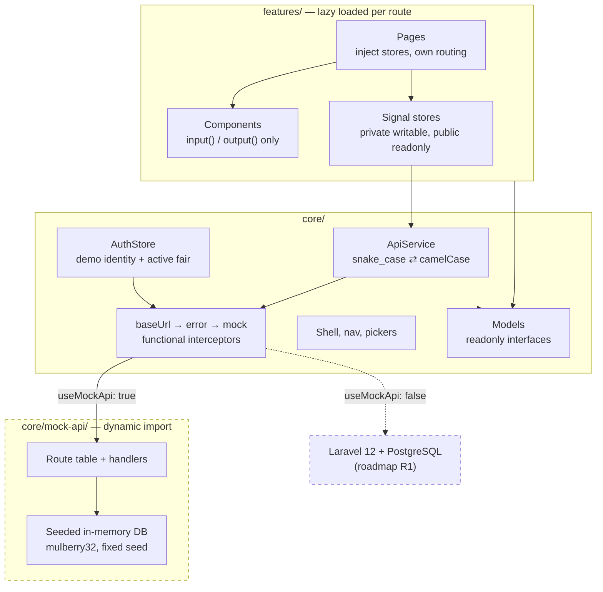

# BankFair

A career fair operations portal for organiser staff and employer hiring managers, built with **Angular 22** and **Tailwind CSS v4**.

> Portfolio demo. The frontend runs against an in-memory mock HTTP API; a Laravel 12 + PostgreSQL backend replaces it later without touching a line of feature code.

**Live demo:** https://majestic-rabanadas-a04cc0.netlify.app

Use the menu in the top right to switch between the three demo identities — no sign-in.

| Identity | Role | Sees |
|---|---|---|
| Farah Iskandar | Staff | Dashboard, fairs, floor plan, employer pipeline |
| Daniel Lim | Hiring manager | Talent pool, shortlist, interviews (has a shortlist and bookings) |
| Priya Nair | Hiring manager | The same screens, with nothing shortlisted yet |

---

## Features

### Staff

- **Dashboard** — four KPIs, booths assigned per fair, pipeline value by stage. Charts load only when scrolled into view.
- **Fairs** — list with status and city filters that live in the URL, plus a detail page whose Overview, Floor plan and Employers tabs are each their own route, so any tab can be linked or refreshed.
- **Floor plan** — a 40-booth grid per fair. Drag an unassigned employer onto a booth, or select a booth and use *Assign employer*. Dropping onto an occupied booth asks before replacing; a successful assignment offers Undo.
- **Employer pipeline** — a Kanban board from Lead to Paid, with each column's committed value in its header. Drag a card or use its menu. Moving to Lost requires a reason; moving to Paid requires a booth package, and opens the edit form if one is missing.

### Hiring manager

- **Talent pool** — 300 candidates, server-side sorted and paginated, with five filters and a debounced search. Shortlist straight from a row rather than opening each profile. Every filter is in the URL, so a filtered view can be shared or refreshed.
- **Candidate profile** — a deep-linkable drawer. Contact details are masked until the candidate is shortlisted.
- **Shortlist** — per fair, with full contact details and notes.
- **Interviews** — twenty-minute slots from 10:00 to 17:00, per day of the fair. Book a shortlisted candidate; a slot taken in the meantime returns a conflict and refreshes the grid.

### Throughout

- Every data view has four states: loading (skeletons shaped like the content), empty, error with Retry, and loaded.
- Every drag action has a keyboard equivalent, and outcomes are announced with `LiveAnnouncer`.
- A **Simulate errors** toggle in the user menu fails roughly one request in five, so the error paths can be demonstrated rather than described. **Reset demo data** reseeds everything.

---

## Architecture



One-way data flow: **API service → store (signals) → components**. Components read signals and call store methods; they never subscribe and never call `HttpClient`.

### Why the mock is an interceptor

Features call `HttpClient` exactly as they will against Laravel, so nothing in `features/` knows the data is fake. Swapping backends is one flag in `environment.ts` — `core/mock-api/` simply stops being reached. It also means failures arrive as real `HttpErrorResponse` values, so the error paths are genuinely exercised rather than simulated.

### Folder structure

```
src/app/
├── core/        auth, http, models, layout, mock-api, error handler
├── shared/      reusable UI, pipes, utils
└── features/    dashboard, fairs, employers, talent-pool, shortlist, interviews
```

See `docs/04-architecture.md` for the full contract, including every endpoint.

---

## Tech decisions

| Decision | Why |
|---|---|
| **Signal stores, not NgRx** | One store per feature, no extra dependency, and the whole pattern fits on a screen. NgRx SignalStore is the next step if this grew. |
| **Mock API as an interceptor** | Keeps feature code backend-agnostic; the Laravel swap is a flag, not a refactor. |
| **snake_case ⇄ camelCase in one place** | `ApiService` converts both directions, including query parameter names, so models stay idiomatic TypeScript and the wire stays Laravel-shaped. |
| **Server-side sort and pagination** | Indistinguishable from client-side at 300 records, but the semantics match what Laravel will do, so switching backends changes no behaviour. |
| **Optimistic where safe, not where it lies** | Drag operations apply immediately and roll back on failure. Booking an interview does not: a conflict there means someone else took the slot, which an optimistic update would paper over. Shortlisting does not either, because the server's response is what unmasks the contact details. |
| **Masking enforced server-side** | The API withholds candidate emails and phones until shortlisted, so an unmasked value never reaches the browser. The `maskEmail` pipe is presentation only and says so. |
| **`DATE_PIPE_DEFAULT_OPTIONS`** | `LOCALE_ID` sets formats but not the timezone. Without pinning `+0800`, a 10:00 slot renders as 02:00 for anyone outside Malaysia. |
| **One hue per chart** | The `docs/03` status palette was measured and fails the colourblind-safety checks (teal↔green ΔE 8.6, red↔green 4.2 under deuteranopia). Charts carry identity in axis labels instead. |
| **Tailwind for layout, Material for components** | Tailwind v4 emits into `@layer`; Material's styles are unlayered, and unlayered beats every layer. So a utility on a Material internal silently does nothing. Tailwind owns layout and rhythm; Material is themed through its own tokens. Tailwind's default palette and type scale are removed, so `bg-blue-500` does not exist and the token system cannot be bypassed. |

---

## Accessibility

Targeting WCAG 2.2 AA.

- Every colour pair in `_tokens.scss` is measured, not assumed. Text pairs clear 4.5:1; UI boundaries clear 3:1. `--fo-border-strong` was darkened to `#64748B` after measuring the original at 1.48:1 — it is the only indicator of an empty booth or an open slot.
- Status is never colour alone: chips and slots carry a label and an icon, and KPI deltas carry a direction arrow.
- Every drag action has a keyboard path, and both paths run through the same code, so they enforce the same rules.
- Dialogs trap and restore focus (Material), Escape closes them, and a dirty form asks before discarding.
- A skip link is the first tab stop. Canvas charts carry an `aria-label` and a visually hidden data table.
- `prefers-reduced-motion` collapses the motion tokens to zero and disables the skeleton shimmer.
- Touch targets reach 44px under `pointer: coarse`; the denser 36px default applies on mouse, which satisfies 2.5.8.
- Every ramp step below 500 is barred from carrying text or acting as a boundary, because step 400 measures 2.64:1 and 2.96:1 — under the 3:1 a UI boundary needs. That rule exists because `--fo-border-strong` once shipped at 1.48:1.
- axe runs over all eleven pages in both roles at three viewports — 1440, 1024 and 390 — behind the real production CSP. 33 page-checks, zero violations.

---

## Getting started

Requires **Node.js ≥ 22.22.3** — the Angular 22 CLI hard-fails below it. npm ≥ 11 for `npm install`; `npm ci` works on any version.

```bash
npm ci
npm start                      # dev server on :4200
npm run build                  # production build → dist/bank-fair/browser
npm test -- --watch=false      # 233 unit tests (Vitest), single run
npm run lint                   # angular-eslint
```

---

## How this was built

Written end to end with **Claude Code on the web** — cloud sessions at claude.ai/code, no local machine involved. The approach was documentation-first: `CLAUDE.md` and seven files in `docs/` specified the stack, engineering rules, UX flows, design system, architecture, seed data and a phased build plan *before* any code existed. Each phase was one session, reviewed through a Netlify deploy preview.

The interesting part was where the documentation turned out to be wrong, and the code had to disagree with it:

- **The seed targets were arithmetically impossible.** `docs/05` asked for 122 occupied booths across the fairs, but its own employer distribution caps the total at 120 — and at 30 for any single fair against a target of 38. Booths became the source of truth and each fair's count is derived from them, so the floor plan, fair list and dashboard cannot disagree.
- **The design system's status palette failed a colourblind check.** Running it through a validator before writing chart code showed teal and green only ΔE 8.6 apart for normal vision. The chips keep the palette; the charts do not.
- **`--fo-border-strong` claimed ≥3:1 and measured 1.48:1.** Caught by computing every token pair rather than trusting the table.
- **Every timestamp was rendering in the viewer's timezone.** A test running in UTC showed interview slots at "2:00 am". `LOCALE_ID` does not set the zone.
- **Drag-assign on the floor plan had never worked.** The list of unassigned employers was a plain list of draggables with no drop list, and a drag belonging to no drop list can be picked up but never dropped into one — so the handler never fired. The keyboard path did work, which is why four phases of review and two accessibility audits missed it. Found by driving the drag in a real browser rather than reading the template.
- **Every HTTP status was collapsing to 0.** The error interceptor normalises failures and rethrows, so stores received an already-normalised error that the normaliser did not recognise as its own output. No 409 read as a conflict and no 422 reached a form field. Every test passed, because `HttpTestingController` bypasses interceptors — the gap was the test strategy, not the assertions.

Each finding is recorded in `docs/06-build-plan.md` under the phase that found it.

---

## Roadmap

| Phase | Item | Notes |
|---|---|---|
| R1 | **Laravel 12 + PostgreSQL API** | Endpoints already match `docs/04`. Set `useMockApi: false` and point `apiBaseUrl` at it; no feature code changes. |
| R2 | **Real auth** | Laravel Sanctum SPA cookie auth, CSRF via `XSRF-TOKEN`, role policies enforced server-side. The current role switcher is demo-only and says so in code. |
| R3 | **AI candidate matching** *(scope TBD)* | Candidate-to-role scoring or shortlist suggestions. Must run server-side — never an LLM key in the browser — and candidate data sent to a model is personal data under the PDPA. |
| R4 | Candidate portal | Registration and a QR check-in pass for fair day. |
| R5 | Bahasa Malaysia | Angular i18n; nothing in the architecture blocks it. |
| R6 | SSR | Public fair listings only, for SEO. |

---

## Notes on the demo data

Everything is fictional. People and companies are invented, all addresses are on `example.com`, and company names are assembled from invented prefixes so no combination lands on a real business. Real Malaysian universities, cities and venues appear for realism — they are public places, not clients.

No sensitive personal data is collected or displayed (no race, religion, health or disability fields), following the Malaysian PDPA 2010.
