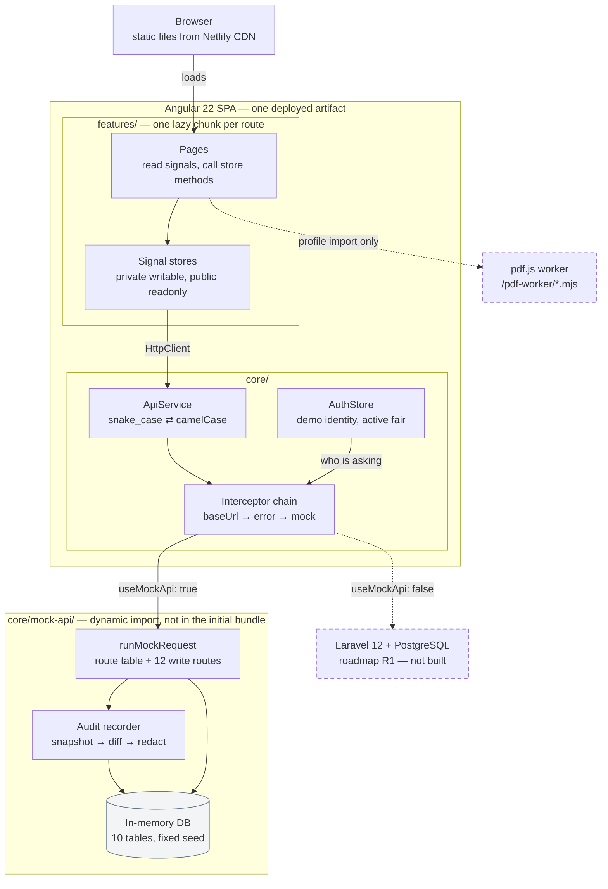

# Architecture — what BankFair is made of

**Answers:** what runs where, and what changes when the Laravel backend arrives.

Derived from `src/app/app.config.ts`, `src/app/core/`, `src/environments/`, `angular.json` and `netlify.toml`.

## What this deliberately leaves out

- **Every feature chunk**, of which there are about fifty. The point is the layering, not the inventory.
- **The audit recorder's descriptor table.** It hangs off the route table; see `02-write-request.md` for where it fires.

## Things the diagram cannot show

- **The mock is an interceptor, not a server.** No request leaves the browser. `mockApiInterceptor` is registered *last* in the chain deliberately, so it short-circuits the request without bypassing `errorInterceptor` above it — which is why a mock failure arrives as a real `HttpErrorResponse` and the error paths are genuinely exercised rather than simulated.
- **The Laravel arrow is the whole switchover.** `environment.useMockApi: false` drops `mockApiInterceptor` from the array and nothing in `features/` changes. That claim is untested against a real backend, because there isn't one yet.
- **The pdf.js worker is same-origin and static**, copied into `/pdf-worker/` by an `angular.json` asset rule rather than bundled. It is reached only when someone opens the profile import.
- **The in-memory database dies with the tab.** Everything — including the audit log — resets on reload.
