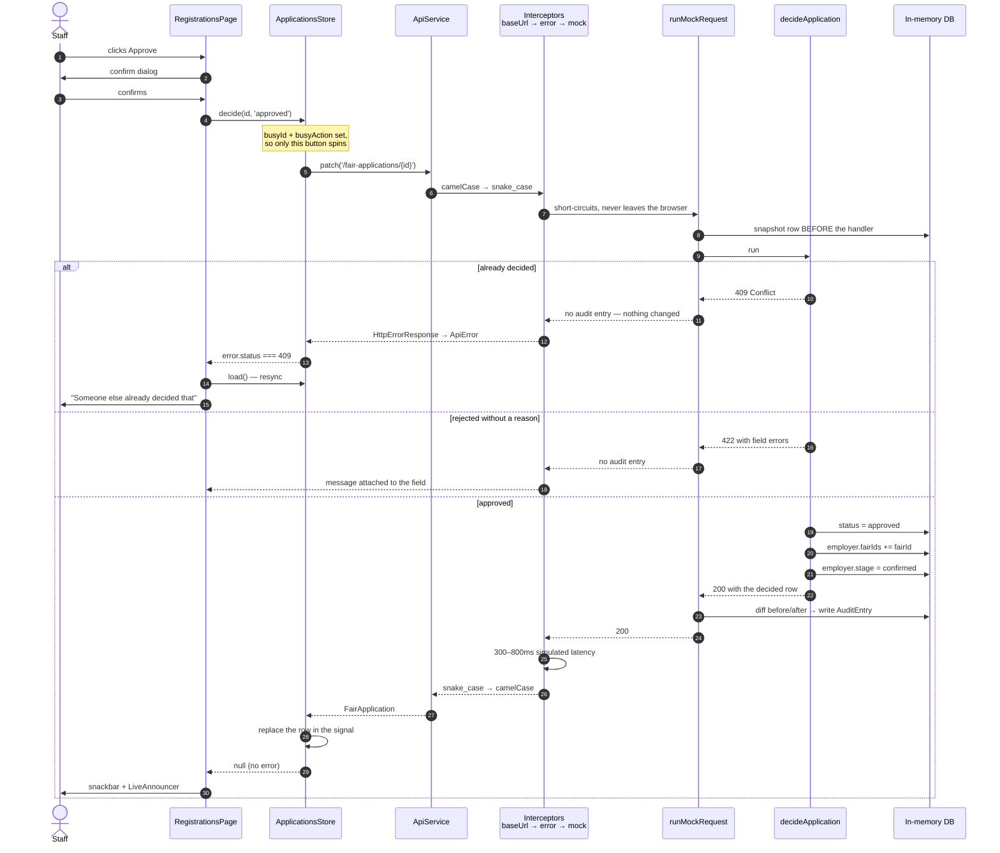

# One write, end to end

**Answers:** what actually happens between a click and a changed record — including the parts no feature code can see.

Traced from `registrations-page.component.ts` → `applications.store.ts` → `api.service.ts` → the interceptor chain → `mock-engine.ts` → `applications.handler.ts`. The example is staff approving an employer's application, because it is the one write that touches every layer: a confirmation, a non-optimistic store, the audit recorder, and a side effect on another table.

## What this deliberately leaves out

- The `roleGuard` that got the user to this page at all; it runs during navigation, not during the request.
- The route progress bar, which is driven by router events rather than by HTTP.

## Things the diagram cannot show

- **Nothing here is optimistic, on purpose.** The row is replaced only after the server agrees. Approving puts a company on a floor plan and moves a sales deal, and showing that as done before it happened would put a company on a plan it may not be on. Withdrawing a fair registration *is* optimistic, because the cost of a wrong guess there is one row reappearing.
- **The audit entry is written by the engine, never by the handler.** `decideApplication` has no idea it is being logged. That is what makes the log complete: a handler that forgets to log would be an invisible hole, whereas a route missing its descriptor is a failing test.
- **Only 2xx is recorded.** The 409 and 422 branches leave no trace, because they changed nothing.
- **The before-snapshot has to be taken before the handler runs.** It is the only reason a *deleted* row can still be labelled in the log — by the time the entry is written, the row is gone.
- **`errorInterceptor` sits above the mock deliberately.** A mock failure is mapped to `ApiError` by exactly the code that will map Laravel's failures, so the 409 and 422 paths above are the real ones, not simulations.
- **The 300–800 ms latency is simulated** and applies to failures as well as successes — a failure that returned instantly would be easier to handle than a real one.
