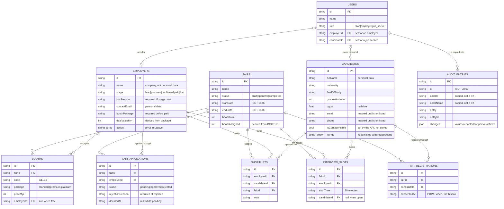

# Data model — the ten tables

**Answers:** what is stored, and how the records relate.

Derived from `src/app/core/models/*.ts` and `src/app/core/mock-api/mock-db.ts`. These are the tables Laravel will implement in R1, so the shapes are the contract rather than an implementation detail.

## What this deliberately leaves out

- Presentation-only fields that the API computes per request rather than stores: `Booth.employerName`, `FairApplication.employerName`, `InterviewSlot.candidateName`, `Shortlist.candidate`. They are denormalised into responses so a list renders without a second call.
- `createdAt` / `updatedAt` on most tables.

## Things the diagram cannot show

- **`fairIds` is an array, and should not be.** `Employer.fairIds` and `Candidate.fairIds` are arrays because the mock has no join table. In PostgreSQL these become `employer_fair` and a derivation from `fair_registrations`. Anyone implementing R1 should treat them as pivots, not columns.
- **`Candidate.isContactVisible` is not stored anywhere.** The API sets it per request from who is asking — the owner, or an employer who has shortlisted them. A migration that creates it as a column has misread this.
- **`AUDIT_ENTRIES` deliberately has no foreign key to `USERS`.** The actor's id and name are copied in. A log that says "user u-emp-1" is useless once that user is gone, and a trail that changes when another record is edited is not a trail.
- **The masking rule is a relationship, not a column.** A candidate's email is visible only when a `SHORTLISTS` row exists for the asking employer — enforced in `candidates.handler.ts`, so an unmasked value never reaches the browser.
- **This diagram is invalidated by any schema change**, so it needs re-checking whenever a model in `src/app/core/models/` changes. It is the most volatile of the four.
