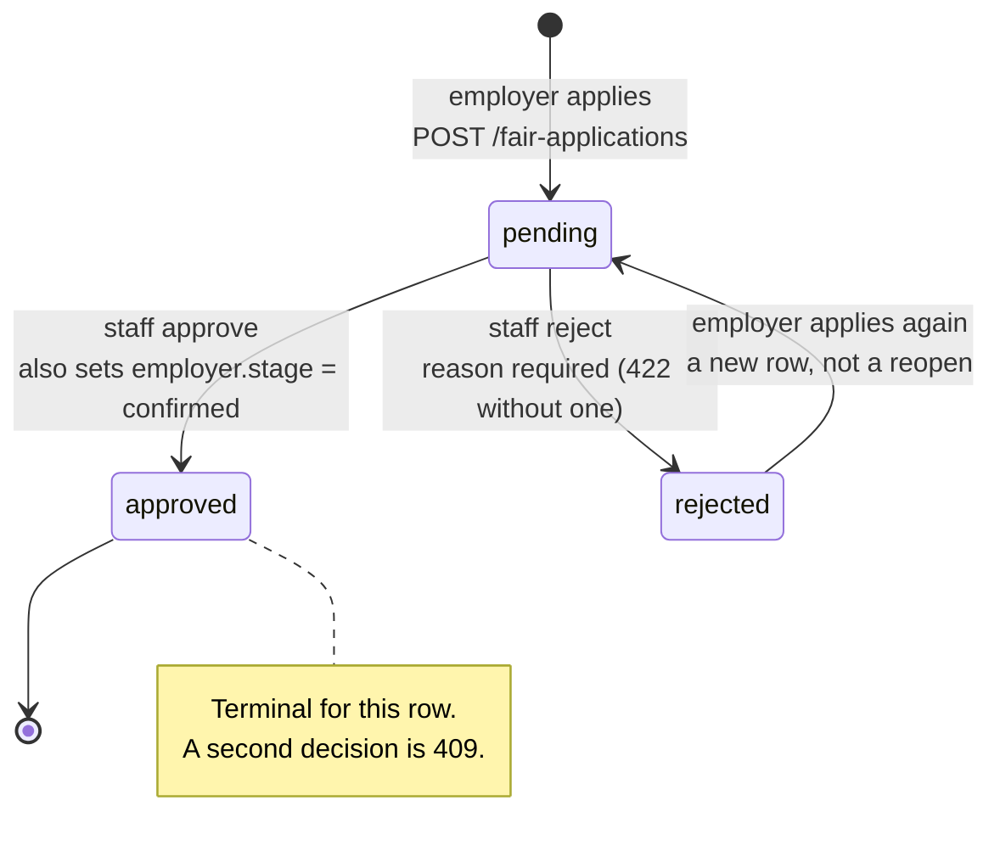
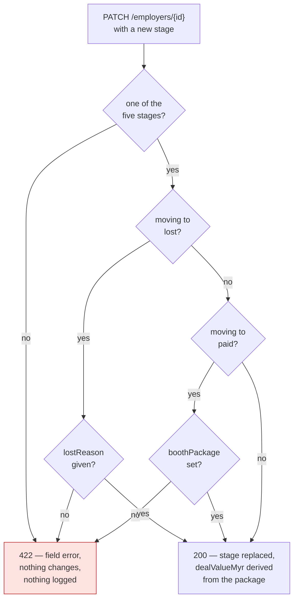

# Lifecycles, and what they actually enforce

**Answers:** what states a record passes through, and — where there is no lifecycle — what the API checks instead.

Derived from `applications.handler.ts`, `employers.handler.ts` and `employers.store.ts`.

## Fair application — a real state machine

An employer applies to attend a fair; staff decide. The API refuses a second decision, so the states mean something.

## Employer pipeline stage — no lifecycle, only guards

**There is deliberately no state diagram here, because there is no state machine.** `updateEmployer` checks only that the target is one of the five stages, and the card menu offers every stage except the current one — so `paid → lead` is permitted by both the UI and the API. Drawing a Lead → Proposal → Confirmed → Paid funnel would show a machine the code does not implement, and a diagram people trust is worse than none.

What the API *does* enforce is two guards:

## Things these diagrams cannot show

- **The absence of a transition table is the finding, not an omission.** Nothing in the demo depends on `paid → lead` being forbidden, but anyone implementing R1 against a real database should not assume the rule exists here. It does not.
- **Approving an application moves the employer's stage as a side effect** — to `confirmed`, unless they are already `paid`, which is never walked back. That coupling is a deliberate demo decision (`docs/09`, S-D7); a real system would confirm a deal when it is signed, not when an application is accepted.
- **Both guards are server-side.** Moving to `lost` without a reason, or to `paid` without a booth package, is a 422 whatever the form sends.
- **`rejected → pending` creates a new row.** The original rejection stays in the table with its reason, which is why an employer can still see why they were turned down after reapplying.
- **A refused transition is not audited**, because it changed nothing.
